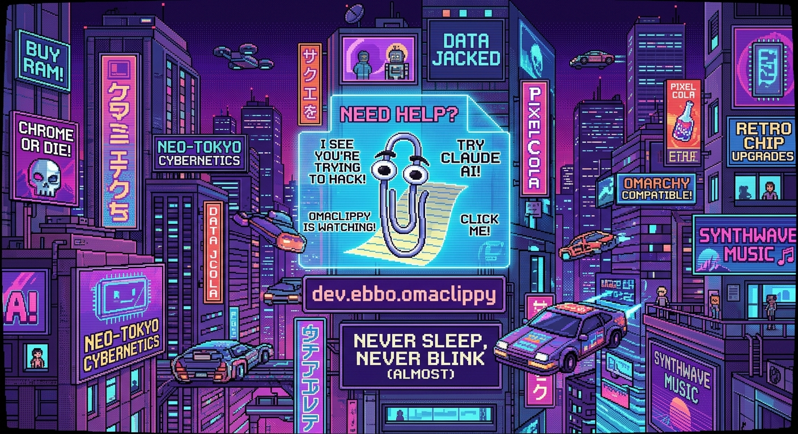

# Omarchy Clippy 📎🤖



What had to be done, had to be done. Nobody asked, still here it is: Meet **omaclippy**—the desktop companion nobody needed, but your tiling setup got anyway.

I took Microsoft’s most iconic, mildly intrusive 1990s office assistant and brought to an Omarchy Linux near you.

## 🛠️ Requirements & Dependency Lore

```bash
# Live 3D renderer keeping Clippy afloat
sudo pacman -S qt6-quick3d

# CRITICAL: Assimp is required by RuntimeLoader to actually parse glTF at runtime.
# Without it, loading fails silently with a generic "Unsupported: Unknown error". 
# We spent hours debugging this so you don't have to.
sudo pacman -S assimp

# Cursor tracking harness (already installed on Omarchy/Hyprland)
# hyprctl

# Optional: Claude CLI for AI-generated quips & replies
# claude

```

---

## 🚀 Quickstart

Enable the plugin and restart the shell:

```bash
omarchy plugin enable dev.ebbo.omaclippy
omarchy-restart-shell

```

Click the 📎 icon in your status bar to toggle his presence, or trigger him programmatically:

```bash
omarchy-shell shell toggle dev.ebbo.omaclippy

```

---

## ⚙️ Architecture & Fallback Flow

```
  [ Cursor Position ] ---> hyprctl ---> Panel.qml ---> [ 3D Model Yaw Rotation ]
                                           |
  [ User Prompt ] ------------------------>+---> QuipService.qml
                                                       |
                                           +-----------+-----------+
                                           |                       |
                                   (Online / Auth)         (Offline / Timeout)
                                           v                       v
                                  claude -p (Haiku)       Fallback Quips.js Bank

```

---

## 🧪 Testing

Want to verify prompt sanitization and fallback logic without rendering 3D assets? Run the zero-dependency test suite:

```bash
node tests/quips.test.js

```

---

*Disclaimer: `dev.ebbo.omaclippy` is provided as-is. Not responsible for sudden drops in productivity or the eerie feeling that your desktop is watching you write code.*
